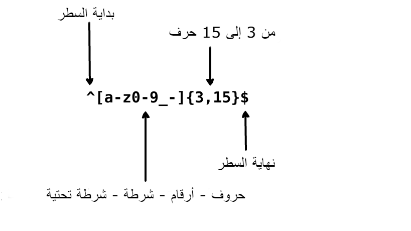

     
    

## Translations:

- [English](README.md)
- [German](../translations/README-de.md)
- [Español](../translations/README-es.md)
- [Français](../translations/README-fr.md)
- [Português do Brasil](../translations/README-pt_BR.md)
- [中文版](../translations/README-cn.md)
- [日本語](../translations/README-ja.md)
- [한국어](../translations/README-ko.md)
- [Turkish](../translations/README-tr.md)
- [Greek](../translations/README-gr.md)
- [Magyar](../translations/README-hu.md)
- [Polish](../translations/README-pl.md)
- [Русский](../translations/README-ru.md)
- [Tiếng Việt](../translations/README-vn.md)
- [العربية](../translations/README-ar.md)

- [فارسی](../translations/README-fa.md)

- [עברית](../translations/README-he.md)

## ما هي التعبيرات النمطية؟

    

> التعبير النمطي هو مجموعة من الأحرف أو الرموز التي تُستخدم للعثور على نمط محدد في النص.

التعبير النمطي هو نمط يتم مطابقته مع سلسلة نصية من اليسار إلى اليمين. تُستخدم التعبيرات النمطية لاستبدال النص داخل سلسلة نصية، والتحقق من صحة النماذج، واستخراج جزء من سلسلة نصية بناءً على تطابق نمط، وأكثر من ذلك بكثير. يُعتبر مصطلح "التعبير النمطي" طويلًا، لذا غالبًا ما تجد المصطلح مختصرًا إلى "regex" أو "regexp".

تخيل أنك تكتب تطبيقًا وتريد وضع القواعد عندما يختار المستخدم اسم المستخدم الخاص به. نريد السماح لاسم المستخدم باحتواء الأحرف والأرقام والشرطات السفلية والشرطات. نريد أيضًا تحديد عدد الأحرف في اسم المستخدم حتى لا يبدو غير جميل. يمكننا استخدام التعبير النمطي التالي للتحقق من صحة اسم المستخدم:

  

  

يمكن للتعبير النمطي أعلاه قبول النصوص `john_doe` و `jo-hn_doe` و `john12_as`. لا يطابق `Jo` لأن ذلك النص تحتوي على حرف كبير وأيضًا عدد الحروف إتنان فقط.

## جدول المحتويات

- [مطابقات أساسية (Basic Matchers)](#1-basic-matchers)
- [الأحرف الخاصة (Meta Characters)](#2-meta-characters)
  - [النقطة (The Full Stop)](#21-the-full-stop)
  - [2.2 مجموعة الأحرف (Character Sets)](#22-character-sets)
    - [مجموعات الأحرف المنفية (Negated Character Sets)](#221-negated-character-sets)
  - [التكرارات (Repetitions)](#23-repetitions)
    - [النجمة (The Star)](#231-the-star)
    - [الزائد (The Plus)](#232-the-plus)
    - [علامة الاستفهام (The Question Mark)](#233-the-question-mark)
  - [الأقواس (Braces)](#24-braces)
  - [مجموعة التقاط (Capturing Groups)](#25-capturing-groups)
    - [نفى مجموعة التقاط (Non-Capturing Groups)](#251-non-capturing-groups)
  - [الاختيار (Alternation)](#26-alternation)
  - [الهروب من الأحرف الخاصة (Escaping Special Characters)](#27-escaping-special-characters)
  - [المراسي (Anchors)](#28-anchors)
    - [الرمز `^` (The Caret)](#281-the-caret)
    - [علامة الدولار `$` (The Dollar Sign)](#282-the-dollar-sign)
- [مجموعات الأحرف المختصرة (Shorthand Character Sets)](#3-shorthand-character-sets)
- [نظرات البحث (Lookarounds)](#4-lookarounds)
  - [النظرة الأمامية الإيجابية (Positive Lookahead)](#41-positive-lookahead)
  - [النظرة الأمامية السلبية (Negative Lookahead)](#42-negative-lookahead)
  - [النظرة الخلفية الإيجابية (Positive Lookbehind)](#43-positive-lookbehind)
  - [النظرة الخلفية السلبية (Negative Lookbehind)](#44-negative-lookbehind)
- [العلامات (Flags)](#5-flags)
  - [حالة الأحرف (Case Insensitive)](#51-case-insensitive)
  - [بحث شامل (Global Search)](#52-global-search)
  - [سطر متعدد (Multiline)](#53-multiline)
- [التطابق الجشع ضد الكسول (Greedy vs Lazy Matching)](#6-greedy-vs-lazy-matching)

## 1. مطابقات أساسية (Basic Matchers)

التعبير النمطي هو مجرد نمط من الأحرف نستخدمه للبحث في النص. على سبيل المثال، التعبير النمطي `the` يعني: الحرف `t` يليه الحرف `h` يليه الحرف `e`.

<pre>
"the" => The fat cat sat on <a href="#learn-regex"><strong>the</strong></a> mat.
</pre>

[اختبر التعبير النمطي من هنا](https://regex101.com/r/dmRygT/1)

التعبير النمطي `123` يتطابق مع السلسلة `123`. يتم مطابقة التعبير النمطي مع نص الإدخال عن طريق مقارنة كل حرف في التعبير النمطي بكل حرف في نص الإدخال، واحدًا تلو الآخر. عادةً ما تكون التعبيرات النمطية حساسة لحالة الأحرف، لذا فإن التعبير النمطي `The` لن يتطابق مع السلسلة `the`.

<pre>
"The" => <a href="#learn-regex"><strong>The</strong></a> fat cat sat on the mat.
</pre>

[اختبر التعبير النمطي من هنا](https://regex101.com/r/1paXsy/1)

## 2. الأحرف الخاصة (Meta Characters)

الأحرف الخاصة هي اللبنات الأساسية للتعبيرات النمطية. الأحرف الخاصة لا تمثل نفسها، بل يتم تفسيرها بطريقة خاصة. بعض الأحرف الخاصة لها معنى خاص ويتم كتابتها داخل أقواس مربعة. الأحرف الخاصة هي كما يلي:

| الحرف الخاص | وصف                                                                                                       |
| :---------: | --------------------------------------------------------------------------------------------------------- | -------- |
|      .      | النقطة تطابق أي حرف مفرد باستثناء فاصل الأسطر.                                                            |
|     [ ]     | فئة الأحرف. تطابق أي حرف موجود بين الأقواس المربعة.                                                       |
|    [^ ]     | فئة الأحرف المنفية. تطابق أي حرف لا يوجد بين الأقواس المربعة.                                             |
|     \*      | تطابق 0 أو أكثر من تكرارات الرمز السابق.                                                                  |
|      +      | تطابق 1 أو أكثر من تكرارات الرمز السابق.                                                                  |
|      ?      | يجعل الرمز السابق اختياريًا.                                                                              |
|    {n,m}    | 
 الأقواس المعقوفة. تطابق على الأقل "n" ولكن لا تتجاوز "m" تكرارات للرمز السابق. 
 |
|    (xyz)    | 
 مجموعة الأحرف. تطابق الأحرف xyz بالترتيب المحدد. 
                               |
|   &#124;    | الاختيار. يطابق إما الأحرف قبل الرمز أو الأحرف بعد الرمز.                                                 |
|    &#92;    | يستخدم للهروب من الحرف التالي. يتيح لك ذلك مطابقة الأحرف المحجوزة <code>[ ] ( ) { } . \* + ? ^ $ \        | </code>. |
|      ^      | يوافق بداية الإدخال.                                                                                      |
|      $      | يوافق نهاية الإدخال.                                                                                      |

## 2.1 النقطة (The Full Stop)

النقطة . هي أبسط مثال على الحرف الخاص. الحرف الخاص `.` يطابق أي حرف مفرد. لن يطابق الأحرف الخاصة بـ `return` أو `newline characters`.
 على سبيل المثال، التعبير النمطي `.ar` يعني: أي حرف، يليه الحرف `a،` يليه الحرف `r`.

<pre>
".ar" => The <a href="#learn-regex"><strong>car</strong></a> <a href="#learn-regex"><strong>par</strong></a>ked in the <a href="#learn-regex"><strong>gar</strong></a>age.
</pre>

[اختبر التعبير النمطي من هنا](https://regex101.com/r/xc9GkU/1)

## 2.2 مجموعة الأحرف (Character Sets)

مجموعات الأحرف تُسمى أيضًا فئات الأحرف. تُستخدم الأقواس المربعة لتحديد مجموعات الأحرف. استخدم الشرطتين داخل مجموعة الأحرف لتحديد نطاق الأحرف. ترتيب نطاق الأحرف داخل الأقواس المربعة لا يهم. على سبيل المثال، التعبير النمطي `[Tt]he`
يعني: الحرف الكبير `T` أو الحرف الصغير `t`، يليه الحرف `h`، يليه الحرف `e`.

<pre>
"[Tt]he" => <a href="#learn-regex"><strong>The</strong></a> car parked in <a href="#learn-regex"><strong>the</strong></a> garage.
</pre>

[اختبر التعبير النمطي من هنا](https://regex101.com/r/2ITLQ4/1)

النقطة داخل مجموعة الأحرف تعني، مع ذلك، نقطة حرفية. التعبير النمطي `ar[.]`
يعني: حرف صغير `a`، يليه الحرف `r`، يليه حرف النقطة `.`.

<pre>
"ar[.]" => A garage is a good place to park a c<a href="#learn-regex"><strong>ar.</strong></a>
</pre>

[اختبر التعبير النمطي من هنا](https://regex101.com/r/wL3xtE/1)

### 2.2.1 مجموعات الأحرف المنفية (Negated Character Sets)

بشكل عام، يمثل رمز الـ caret بداية السلسلة، ولكن عندما يُكتب بعد القوس المربع الافتتاحي، فإنه ينفي مجموعة الأحرف. على سبيل المثال، التعبير النمطي `[^c]ar`
يعني: أي حرف ما عدا `c`، يليه الحرف `a`، يليه الحرف `r`.

<pre>
"[^c]ar" => The car <a href="#learn-regex"><strong>par</strong></a>ked in the <a href="#learn-regex"><strong>gar</strong></a>age.
</pre>

[اختبر التعبير النمطي من هنا](https://regex101.com/r/nNNlq3/1)

## 2.3 التكرارات (Repetitions)

تُستخدم الأحرف الخاصة `+` و `*` و `?` لتحديد عدد مرات تكرار النمط الفرعي. تعمل هذه الأحرف الخاصة بطرق مختلفة في سياقات مختلفة.

### 2.3.1 النجمة (The Star)

رمز `*` يطابق صفر أو أكثر من تكرارات النمط السابق. التعبير النمطي `a*`
يعني: صفر أو أكثر من تكرارات الحرف الصغير `a` السابق. ولكن إذا ظهر بعد مجموعة أحرف أو فئة، فإنه يبحث عن تكرارات مجموعة الأحرف بالكامل. على سبيل المثال، التعبير النمطي `[a-z]*`
يعني: أي عدد من الأحرف الصغيرة متتالية.

<pre>
"[a-z]*" => T<a href="#learn-regex"><strong>he</strong></a> <a href="#learn-regex"><strong>car</strong></a> <a href="#learn-regex"><strong>parked</strong></a> <a href="#learn-regex"><strong>in</strong></a> <a href="#learn-regex"><strong>the</strong></a> <a href="#learn-regex"><strong>garage</strong></a> #21.
</pre>

[اختبر التعبير النمطي من هنا](https://regex101.com/r/7m8me5/1)

يمكن استخدام رمز `*` مع الحرف الخاص `.` لمطابقة أي سلسلة من الأحرف `.*`. يمكن أيضًا استخدام رمز `*` مع حرف المسافة `s\` لمطابقة سلسلة من أحرف المسافة. على سبيل المثال، التعبير النمطي `\s*cat\s*`
يعني: صفر أو أكثر من المسافات، يليه حرف صغير `c`، يليه حرف صغير `a`، يليه حرف صغير `t`، يليه صفر أو أكثر من المسافات.

<pre>
"\s*cat\s*" => The fat<a href="#learn-regex"><strong> cat </strong></a>sat on the con<a href="#learn-regex"><strong>cat</strong></a>enation.
</pre>

[اختبر التعبير النمطي من هنا](https://regex101.com/r/gGrwuz/1)

### 2.3.2 الزائد (The Plus)

رمز `+` يطابق تكرار واحد أو أكثر من الحرف السابق. على سبيل المثال، التعبير النمطي `c.+t` يعني: حرف صغير `c`، يليه على الأقل حرف واحد، يليه حرف صغير `t`. يجب توضيح أن `t` هو آخر `t` في الجملة.

<pre>
"c.+t" => The fat <a href="#learn-regex"><strong>cat sat on the mat</strong></a>.
</pre>

[اختبر التعبير النمطي من هنا](https://regex101.com/r/Dzf9Aa/1)

### 2.3.3 علامة الاستفهام (The Question Mark)

في التعبيرات النمطية، الحرف الخاص `?` يجعل الحرف السابق اختياريًا. يطابق هذا الرمز صفر أو واحدة من الحرف السابق. على سبيل المثال، التعبير النمطي `[T]?he`
يعني: حرف كبير اختياري `T`، يليه حرف صغير `h`، يليه حرف صغير `e`.

<pre>
"[T]he" => <a href="#learn-regex"><strong>The</strong></a> car is parked in the garage.
</pre>

[اختبر التعبير النمطي من هنا](https://regex101.com/r/cIg9zm/1)

<pre>
"[T]?he" => <a href="#learn-regex"><strong>The</strong></a> car is parked in t<a href="#learn-regex"><strong>he</strong></a> garage.
</pre>

[اختبر التعبير النمطي من هنا](https://regex101.com/r/kPpO2x/1)

## 2.4 الأقواس (Braces)

في التعبيرات النمطية، تُستخدم الأقواس المعقوفة (وتسمى أيضًا المقاييس) لتحديد عدد مرات تكرار حرف أو مجموعة من الأحرف. على سبيل المثال، التعبير النمطي `[0-9]{2,3}`
يعني: مطابقة على الأقل 2 أرقام، ولكن ليس أكثر من 3، تتراوح بين 0 و9.

<pre>
"[0-9]{2,3}" => The number was 9.<a href="#learn-regex"><strong>999</strong></a>7 but we rounded it off to <a href="#learn-regex"><strong>10</strong></a>.0.
</pre>

[اختبر التعبير النمطي من هنا](https://regex101.com/r/juM86s/1)

يمكننا تجاهل الرقم الثاني. على سبيل المثال، التعبير النمطي `[0-9]{2,}`
يعني: مطابقة 2 أو أكثر من الأرقام. إذا قمنا أيضًا بحذف الفاصلة، فإن التعبير النمطي {3}[0-9]
يعني: مطابقة بالضبط 3 أرقام.

<pre>
"[0-9]{2,}" => The number was 9.<a href="#learn-regex"><strong>9997</strong></a> but we rounded it off to <a href="#learn-regex"><strong>10</strong></a>.0.
</pre>

[اختبر التعبير النمطي من هنا](https://regex101.com/r/Gdy4w5/1)

<pre>
"[0-9]{3}" => The number was 9.<a href="#learn-regex"><strong>999</strong></a>7 but we rounded it off to 10.0.
</pre>

[اختبر التعبير النمطي من هنا](https://regex101.com/r/Sivu30/1)

## 2.5 مجموعة التقاط (Capturing Groups)

مجموعة التقاط هي مجموعة من الأنماط الفرعية التي تُكتب داخل أقواس `(...)`. كما ناقشنا سابقًا، في التعبيرات النمطية، إذا وضعنا محدد تكرار بعد حرف، فإنه سيكرر الحرف السابق. ولكن إذا وضعنا محدد تكرار بعد مجموعة التقاط، فإنه يكرر المجموعة بأكملها. على سبيل المثال، التعبير النمطي `(ab)*` يطابق صفر أو أكثر من تكرارات الحرف "ab". يمكننا أيضًا استخدام الرمز `|` داخل مجموعة التقاط. على سبيل المثال، التعبير النمطي `(c|g|p)ar` يعني: حرف صغير `c` ، أو `g` ، أو `p` ، يليه `a` ، يليه `r` .

<pre>
"(c|g|p)ar" => The <a href="#learn-regex"><strong>car</strong></a> is <a href="#learn-regex"><strong>par</strong></a>ked in the <a href="#learn-regex"><strong>gar</strong></a>age.
</pre>

[اختبر التعبير النمطي من هنا](https://regex101.com/r/tUxrBG/1)

لاحظ أن مجموعات الالتقاط لا تطابق فقط ولكنها أيضًا تلتقط الأحرف لاستخدامها في اللغة الأم. يمكن أن تكون اللغة الأم Python أو JavaScript أو أي لغة تقريبًا تقوم بتنفيذ التعبيرات النمطية في تعريف الوظائف.

### 2.5.1 نفى مجموعة التقاط (Non-Capturing Groups)

مجموعة غير ملتقطة هي مجموعة تقاط تتطابق مع الأحرف ولكنها لا تلتقط المجموعة. تُرمز المجموعة غير الملتقطة باستخدام علامة استفهام `?` تليها نقطتان `:` داخل الأقواس `(...)`. على سبيل المثال، التعبير النمطي `(?:c|g|p)ar` مشابه لـ `(c|g|p)ar` من حيث أنه يتطابق مع نفس الأحرف ولكن لن ينشئ مجموعة التقاط.

<pre>
"(?:c|g|p)ar" => The <a href="#learn-regex"><strong>car</strong></a> is <a href="#learn-regex"><strong>par</strong></a>ked in the <a href="#learn-regex"><strong>gar</strong></a>age.
</pre>

[اختبر التعبير النمطي من هنا](https://regex101.com/r/Rm7Me8/1)

تكون مجموعات غير التقاط مفيدة عند استخدامها في وظائف البحث والاستبدال أو عند مزجها مع مجموعات التقاط للحفاظ على الوضوح عند إنتاج أي نوع آخر من المخرجات.

راجع أيضًا [4. Lookaround](#4-lookaround).

## 2.6 الاختيار (Alternation)

في التعبيرات النمطية، يُستخدم الرمز العمودي `|` لتحديد الاختيار. الاختيار يشبه عبارة OR بين تعبيرات متعددة. قد تعتقد الآن أن مجموعات الأحرف والاختيار تعملان بنفس الطريقة. لكن الفرق الكبير بين مجموعات الأحرف والاختيار هو أن مجموعات الأحرف تعمل على مستوى الحرف بينما الاختيار يعمل على مستوى التعبير. على سبيل المثال، التعبير النمطي `he|car` `(T|t)` يعني: إما (حرف كبير `T` أو حرف صغير `t`، يليه حرف صغير `h`، يليه حرف صغير `e`) أو (حرف صغير `c`، يليه حرف صغير `a`، يليه حرف صغير `r`). لاحظ أنني أدرجت الأقواس للتوضيح، لإظهار أنه يمكن مطابقة أي تعبير بين الأقواس، وسيتطابق.

في التعبير النمطي، تُستخدم العلامة العمودية `|` لتحديد التبديل (alternation). التبديل يشبه عبارة OR بين تعبيرات متعددة. قد تفكر الآن أن مجموعات الأحرف والتبديل تعملان بنفس الطريقة، ولكن الفرق الكبير بين مجموعات الأحرف والتبديل هو أن مجموعات الأحرف تعمل على مستوى الأحرف بينما التبديل يعمل على مستوى التعبيرات. على سبيل المثال، التعبير النمطي `(T|t)he|car` يعني: إما (حرف كبير `T` أو حرف صغير `t` ، يليه حرف صغير `h` ، يليه حرف صغير `e` ) أو (حرف صغير `c` ، يليه حرف صغير `a` ، يليه حرف صغير `r`). لاحظ أنني أدرجت الأقواس للتوضيح، لإظهار أنه يمكن تلبية أي من التعبيرين داخل الأقواس وسيتطابق.

<pre>
"(T|t)he|car" => <a href="#learn-regex"><strong>The</strong></a> <a href="#learn-regex"><strong>car</strong></a> is parked in <a href="#learn-regex"><strong>the</strong></a> garage.
</pre>

[اختبر التعبير النمطي من هنا](https://regex101.com/r/fBXyX0/1)

## 2.7 الهروب من الأحرف الخاصة (Escaping Special Characters)

يتم استخدام الخط المائل العكسي `\` في التعبيرات النمطية للهروب من الحرف التالي. يتيح لنا ذلك تضمين الأحرف المحجوزة مثل `{ } [ ] / \ + * . $ ^ | ?`  كأحرف للمطابقة. لاستخدام أحد هذه الأحرف الخاصة كحرف مطابقة، قم بإلحاقه بـ `\`.

على سبيل المثال، يتم استخدام التعبير النمطي `.` لمطابقة أي حرف باستثناء سطر جديد. الآن، لمطابقة `.` في سلسلة الإدخال، فإن التعبير النمطي `(f|c|m)at\.?` يعني: حرف صغير `f` أو `c` أو `m`، متبوع بحرف صغير `a`، متبوع بحرف صغير `t`، متبوع بحرف `.` اختياري.

<pre>
"(f|c|m)at\.?" => The <a href="#learn-regex"><strong>fat</strong></a> <a href="#learn-regex"><strong>cat</strong></a> sat on the <a href="#learn-regex"><strong>mat.</strong></a>
</pre>

[اختبر التعبير النمطي من هنا](https://regex101.com/r/DOc5Nu/1)

## 2.8 المراسي (Anchors)

في التعبيرات النمطية، نستخدم المثبتات للتحقق مما إذا كان رمز المطابقة هو الرمز الأول أو الأخير في سلسلة الإدخال. هناك نوعان من المثبتات: النوع الأول هو علامة العطف `^` التي تتحقق مما إذا كان حرف المطابقة هو الحرف الأول في سلسلة الإدخال، والنوع الثاني هو علامة الدولار `$` التي تتحقق مما إذا كان حرف المطابقة هو الحرف الأخير في سلسلة الإدخال.

### 2.8.1 الرمز `^` (The Caret)

يتم استخدام رمز العطف `^` للتحقق مما إذا كان حرف المطابقة هو الحرف الأول في سلسلة الإدخال. إذا قمنا بتطبيق التعبير النمطي التالي `^a` (أي يجب أن يكون "a" هو الحرف الأول) على السلسلة `abc`، فسيطابق الحرف `a` . ولكن إذا قمنا بتطبيق التعبير النمطي `^b` على السلسلة المذكورة أعلاه، فلن يطابق أي شيء، لأن الحرف "b" في السلسلة `abc` ليس الحرف الأول. دعونا نلقي نظرة على تعبير نمطي آخر `^(T|t)he`، والذي يعني: يجب أن يكون الحرف `T` كبيرًا أو `t` صغيرًا هو الحرف الأول في السلسلة، متبوعًا بحرف صغير `h` ، متبوعًا بحرف صغير `e` .

<pre>
"(T|t)he" => <a href="#learn-regex"><strong>The</strong></a> car is parked in <a href="#learn-regex"><strong>the</strong></a> garage.
</pre>

[اختبر التعبير النمطي من هنا](https://regex101.com/r/5ljjgB/1)

<pre>
"^(T|t)he" => <a href="#learn-regex"><strong>The</strong></a> car is parked in the garage.
</pre>

[اختبر التعبير النمطي من هنا](https://regex101.com/r/jXrKne/1)

### 2.8.2 علامة الدولار `$` (The Dollar Sign)

يتم استخدام علامة الدولار `$` للتحقق مما إذا كان حرف المطابقة هو الحرف الأخير في السلسلة. على سبيل المثال، التعبير النمطي `(at\.)$` يعني: حرف صغير `a` ، متبوع بحرف صغير `t` ، متبوع بحرف `.` ويجب أن تكون المطابقة في نهاية السلسلة.

<pre>
"(at\.)" => The fat c<a href="#learn-regex"><strong>at.</strong></a> s<a href="#learn-regex"><strong>at.</strong></a> on the m<a href="#learn-regex"><strong>at.</strong></a>
</pre>

[اختبر التعبير النمطي من هنا](https://regex101.com/r/y4Au4D/1)

<pre>
"(at\.)$" => The fat cat. sat. on the m<a href="#learn-regex"><strong>at.</strong></a>
</pre>

[اختبر التعبير النمطي من هنا](https://regex101.com/r/t0AkOd/1)

## 3. مجموعات الأحرف المختصرة (Shorthand Character Sets)

There are a number of convenient shorthands for commonly used character sets/
regular expressions:

| اختصار | وصف                                                                   |
| :----: | --------------------------------------------------------------------- |
|   .    | أي حرف باستثناء سطر جديد                                              |
|   \w   | يطابق الأحرف الأبجدية الرقمية: `[a-zA-Z0-9_]`. |
|   \W   | يطابق الأحرف غير الأبجدية الرقمية: `[^\w]`.    |
|   \d   | يطابق الأرقام: `[0-9]`.                        |
|   \D   | يطابق غير الأرقام: `[^\d]`.                    |
|   \s   | يطابق الأحرف البيضاء: `[\t\n\f\r\p{Z}]`.       |
|   \S   | يطابق غير الأحرف البيضاء: `[^\s]`.             |

## 4. نظرات البحث (Lookarounds)

الـ **_مجموعات غير الملتقطة_** (التي تستخدم لمطابقة نمط ولكن دون تضمينه في قائمة المطابقة) تشمل الـ Lookbehinds و Lookaheads (التي تُسمى أيضًا Lookarounds). تُستخدم الـ Lookarounds عندما يجب أن يكون النمط متبوعًا أو مسبوقًا بنمط آخر. على سبيل المثال، إذا أردنا الحصول على جميع الأرقام التي تسبقها علامة `$` من السلسلة `$4.44 and $10.88`، سنستخدم التعبير النمطي التالي `(?<=\$)[0-9\.]*`، والذي يعني: الحصول على جميع الأرقام التي تحتوي على الحرف `.` وتسبقها علامة `$` . وهذه هي الـ Lookarounds المستخدمة في التعبيرات النمطية:

| رمز | وصف                       |
| :-: | ------------------------- |
| ?=  | النظرة الأمامية الإيجابية |
| ?!  | النظرة الأمامية السلبية   |
| ?<= | النظرة الخلفية الإيجابية  |
| ?<! | النظرة الخلفية السلبية    |

### 4.1 النظرة الأمامية الإيجابية (Positive Lookahead)

النظرة الأمامية الإيجابية تؤكد أن الجزء الأول من التعبير يجب أن يتبعه التعبير الموجود في النظرة الأمامية. النتيجة المحتجزة تحتوي فقط على النص الذي يتطابق مع الجزء الأول من التعبير. لتعريف نظرة أمامية إيجابية، تُستخدم الأقواس. داخل تلك الأقواس، يُستخدم علامة الاستفهام مع علامة التساوي مثل هذا: `(?=...)` . يُكتب التعبير الموجود في النظرة الأمامية بعد علامة التساوي داخل الأقواس. على سبيل المثال، التعبير النمطي `(T|t)he(?=\sfat)` يعني: مطابقة إما حرف صغير `t` أو حرف كبير `T` ، متبوعًا بالحرف `h` ، متبوعًا بالحرف `e` . في الأقواس نحدد نظرة أمامية إيجابية التي تخبر محرك التعبيرات النمطية بمطابقة `The` أو `the` فقط إذا كانت متبوعة بكلمة `fat` .

<pre>
"(T|t)he(?=\sfat)" => <a href="#learn-regex"><strong>The</strong></a> fat cat sat on the mat.
</pre>

[اختبر التعبير النمطي من هنا](https://regex101.com/r/IDDARt/1)

### 4.2 النظرة الأمامية السلبية (Negative Lookahead)

تُستخدم النظرات الأمامية السلبية عندما نحتاج إلى الحصول على جميع المطابقات من سلسلة الإدخال التي لا يتبعها نمط معين. تُكتب النظرة الأمامية السلبية بنفس طريقة كتابة النظرة الأمامية الإيجابية، الفرق الوحيد هو أننا نستخدم علامة التعجب `!` بدلاً من علامة التساوي `=` للإشارة إلى النفي، أي `(?!...)`. دعنا نلقي نظرة على التعبير النمطي التالي `(T|t)he(?!\sfat)`، والذي يعني: الحصول على جميع الكلمات `The` أو `the` من سلسلة الإدخال التي لا يتبعها حرف مسافة وكلمة `fat`.

<pre>
"(T|t)he(?!\sfat)" => The fat cat sat on <a href="#learn-regex"><strong>the</strong></a> mat.
</pre>

[اختبر التعبير النمطي من هنا](https://regex101.com/r/V32Npg/1)

### 4.3 النظرة الخلفية الإيجابية (Positive Lookbehind)

تُستخدم النظرات الخلفية الإيجابية للحصول على جميع المطابقات التي تسبقها نمط معين.
 
تُكتب النظرة الخلفية الإيجابية كالتالي: `(?<=...)` . على سبيل المثال، التعبير النمطي `(?<=(T|t)he\s)(fat|mat)`  
يعني: الحصول على جميع الكلمات
`fat` أو `mat` من سلسلة الإدخال التي تأتي بعد كلمة `The` أو `the` .

<pre>
"(?<=(T|t)he\s)(fat|mat)" => The <a href="#learn-regex"><strong>fat</strong></a> cat sat on the <a href="#learn-regex"><strong>mat</strong></a>.
</pre>

[اختبر التعبير النمطي من هنا](https://regex101.com/r/avH165/1)

### 4.4 النظرة الخلفية السلبية (Negative Lookbehind)

تُستخدم النظرات الخلفية السلبية للحصول على جميع المطابقات التي لا تسبقها نمط معين.
 
تُكتب النظرة الخلفية السلبية كالتالي: `(?<!...)`. على سبيل المثال، التعبير النمطي `(?<!(T|t)he\s)(cat)`
 
يعني: الحصول على جميع الكلمات `cat` من سلسلة الإدخال التي لا تأتي بعد كلمة `The` أو `the`.

<pre>
"(?&lt;!(T|t)he\s)(cat)" => The cat sat on <a href="#learn-regex"><strong>cat</strong></a>.
</pre>

[اختبر التعبير النمطي من هنا](https://regex101.com/r/8Efx5G/1)

## 5. العلامات (Flags)

تُسمى العلامات أيضًا بـ **المعدلات** لأنها تعدل ناتج التعبير النمطي. يمكن استخدام هذه العلامات بأي ترتيب أو مجموعة، وهي جزء أساسي من تعبيرات الـ RegExp.

| علامة | وصف                                             |
| :---: | ----------------------------------------------- |
|   i   | حساس للحالة: ستكون المطابقة غير حساسة للحالة.   |
|   g   | بحث شامل: مطابقة جميع الحالات، وليس فقط الأولى. |
|   m   | متعدد الأسطر: تعمل رموز التثبيت على كل سطر.     |

### 5.1 حالة الأحرف (Case Insensitive)

المعدل `i` يُستخدم لإجراء مطابقة غير حساسة لحالة الأحرف. على سبيل المثال، التعبير النمطي `/The/gi` يعني: حرف كبير `T`، يليه حرف صغير `h`، يليه حرف `e`. وفي نهاية التعبير النمطي، تُشير العلامة `i` إلى محرك التعبيرات النمطية لتجاهل الحالة. كما ترى، قمنا أيضًا بتوفير العلامة `g` لأننا نريد البحث عن النمط في سلسلة الإدخال بالكامل.

<pre>
"The" => <a href="#learn-regex"><strong>The</strong></a> fat cat sat on the mat.
</pre>

[اختبر التعبير النمطي من هنا](https://regex101.com/r/dpQyf9/1)

<pre>
"/The/gi" => <a href="#learn-regex"><strong>The</strong></a> fat cat sat on <a href="#learn-regex"><strong>the</strong></a> mat.
</pre>

[اختبر التعبير النمطي من هنا](https://regex101.com/r/ahfiuh/1)

### 5.2 بحث شامل (Global Search)

المعدل `g` يُستخدم لتنفيذ مطابقة شاملة (يجد جميع المطابقات بدلاً من التوقف بعد المطابقة الأولى). على سبيل المثال، التعبير النمطي `/.(at)/g` يعني: أي حرف باستثناء سطر جديد، يليه حرف صغير `a`، يليه حرف صغير `t`. لأننا قمنا بتوفير العلامة `g` في نهاية التعبير النمطي، سيجد الآن جميع المطابقات في سلسلة الإدخال، وليس فقط المطابقة الأولى (التي هي السلوك الافتراضي).

<pre>
"/.(at)/" => The <a href="#learn-regex"><strong>fat</strong></a> cat sat on the mat.
</pre>

[اختبر التعبير النمطي من هنا](https://regex101.com/r/jnk6gM/1)

<pre>
"/.(at)/g" => The <a href="#learn-regex"><strong>fat</strong></a> <a href="#learn-regex"><strong>cat</strong></a> <a href="#learn-regex"><strong>sat</strong></a> on the <a href="#learn-regex"><strong>mat</strong></a>.
</pre>

[اختبر التعبير النمطي من هنا](https://regex101.com/r/dO1nef/1)

### 5.3 سطر متعدد (Multiline)

المعدل `m` يُستخدم لتنفيذ مطابقة متعددة الأسطر. كما ناقشنا سابقًا، تُستخدم الرموز المثبتة `(^, $)` للتحقق مما إذا كان نمط معين في بداية الإدخال أو نهايته. ولكن إذا أردنا أن تعمل الرموز المثبتة على كل سطر، نستخدم العلامة `m` . على سبيل المثال، التعبير النمطي `/at(.)?$/gm` يعني: حرف صغير `a` ، يليه حرف صغير `t` ، و، اختياريًا، أي شيء باستثناء سطر جديد. وبفضل العلامة `m` ، يقوم محرك التعبيرات النمطية الآن بمطابقة الأنماط في نهاية كل سطر في السلسلة.

<pre>
"/.at(.)?$/" => The fat
                cat sat
                on the <a href="#learn-regex"><strong>mat.</strong></a>
</pre>

[اختبر التعبير النمطي من هنا](https://regex101.com/r/hoGMkP/1)

<pre>
"/.at(.)?$/gm" => The <a href="#learn-regex"><strong>fat</strong></a>
                  cat <a href="#learn-regex"><strong>sat</strong></a>
                  on the <a href="#learn-regex"><strong>mat.</strong></a>
</pre>

[اختبر التعبير النمطي من هنا](https://regex101.com/r/E88WE2/1)

## 6. التطابق الجشع ضد الكسول (Greedy vs Lazy Matching)

بشكل افتراضي، ستقوم التعبيرات النمطية بتنفيذ مطابقة جشعة، مما يعني أن المطابقة ستكون أطول ما يمكن. يمكننا استخدام `?` لمطابقة بطريقة كسولة، مما يعني أن المطابقة ستكون أقصر ما يمكن.

<pre>
"/(.*at)/" => <a href="#learn-regex"><strong>The fat cat sat on the mat</strong></a>. </pre>

[اختبر التعبير النمطي من هنا](https://regex101.com/r/AyAdgJ/1)

<pre>
"/(.*?at)/" => <a href="#learn-regex"><strong>The fat</strong></a> cat sat on the mat. </pre>

[اختبر التعبير النمطي من هنا](https://regex101.com/r/AyAdgJ/2)

## مساهمة

- افتح طلب سحب مع التحسينات
- ناقش الأفكار في قسم المشكلات
- نشر الكلمة
- تواصل معنا بأي تقييم مناسب 

## ترخيص

MIT &copy; [Zeeshan Ahmad](https://twitter.com/ziishaned)
